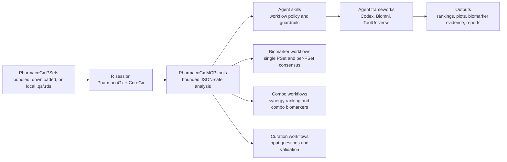

# PharmacoGx Agentic Architecture And Manuscript Figures

## Architecture Schematic

## Candidate Figures

1. Architecture schematic showing PharmacoGx PSets, R/MCP execution, skills,
   and agent frameworks.
2. Gemcitabine biomarker case study seeded by SLC29A1/hENT1, with PSet-backed
   evidence and external context kept separate.
3. Multi-PSet biomarker consensus workflow showing independent per-PSet tests
   and direction/p-value synthesis without raw pooling.
4. High-confidence combo synergy ranking using real combo PSets such as
   NCI-ALMANAC or GDSC-square Matrix/Anchor.
5. Combo biomarker workflow using a selected synergy or combo-response
   phenotype and mutation/CNV features.
6. Agent benchmark summary: task success, correct tool selection,
   reproducibility, unsupported-data handling, and hallucination avoidance.

## Benchmark Scenarios

- Identify a known drug biomarker candidate and verify whether PSet evidence is
  available.
- Compare biomarker support across multiple PSets without pooling raw data.
- Rank synergistic drug combinations from a real combo PSet.
- Explain why a combo biomarker result is exploratory when sample or feature
  support is sparse.
- Distinguish toy-data demonstrations from real local PSet-backed analyses.
